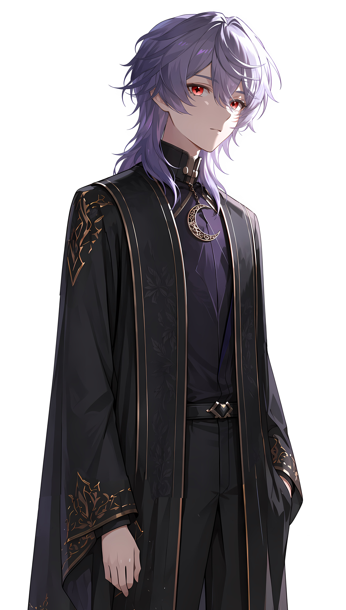

# 森口智子

**Moriguchi Tomoko**

> 月光会东国执事

点击展开

  
> 旧世界侵蚀之调律者·新世界空之调律者

  

    <table style="border-collapse: collapse; width: 100%;">
      <tr><td style="padding: 4px 8px; font-weight: bold;">年龄</td><td style="padding: 4px 8px;">约30岁</td></tr>
      <tr><td style="padding: 4px 8px; font-weight: bold;">身份</td><td style="padding: 4px 8px;">月光会东国执事</td></tr>
      <tr><td style="padding: 4px 8px; font-weight: bold;">身高</td><td style="padding: 4px 8px;">178cm</td></tr>
      <tr><td style="padding: 4px 8px; font-weight: bold;">外貌</td><td style="padding: 4px 8px;">紫色短发，红色眼睛，十字瞳孔</td></tr>
      <tr><td style="padding: 4px 8px; font-weight: bold;">人格类型</td><td style="padding: 4px 8px;">INFJ</td></tr>
       <tr><td style="padding: 4px 8px; font-weight: bold;">卡组</td><td style="padding: 4px 8px;">「三太阳历」</td></tr>
    </table>
  

  

    
  

 

## 性格

**主导性格：** 伪装大师。表面上温和、谦逊、忠诚、幽默，是完美的副手和执行者。实则内心极度偏执、冷静到冷酷，对世界怀有刻骨的憎恨。

**次要性格：** 强烈的秩序癖和洁癖。他憎恨旧世界的“肮脏”和“混乱”，渴望建立一个绝对纯净、没有痛苦的“新世界”。

**性格弱点：** 无法摆脱过去的创伤，他的所有行为都是对童年悲剧的过度补偿。他无法完全信任任何人——包括曾经敬仰的[乔伊](../../03-异次元之融合/角色/乔伊·弗罗斯特2.md)——任何与他理想相悖的行为都会被他视为“背叛”。

---

## 能力设定

- 出色的组织管理能力，能将月光会的隐秘网络运作得滴水不漏
- 后期成为“侵蚀之调律者”，能够操控湮灭能，侵蚀并控制所有电子设备和AI，大规模复苏地缚神
- 知识储备涵盖计算机科学、网络安全、神秘学、心理学

---

## 三观

**世界观：** 虚无主义和精英主义。旧世界从根源上已经腐烂，必须彻底推倒重来。只有他这样的觉悟者才有资格执行这场“大清洗”。

**人生观：** 牺牲是必要的，痛苦是必须被根除的。为了创造一个没有痛苦的永恒乐园，现在的一切生命都可以被牺牲。

**价值观：** 绝对的秩序和纯净是最高价值。

---

## 人际关系

- **父亲**：因举报企业乱排污水被推入海洋。这是他仇恨世界的根源
- **母亲**：因父亲冤死而患上心病，在智子高考时去世
- **[乔伊·弗罗斯特](乔伊·弗罗斯特.md)**：最初视之为带来“答案”与“力量”的导师，甚至是偶像。后期关系破裂的根源是“幻灭”——他发现乔伊的道路无法实现他所渴望的终极救赎。[乔伊](../../03-异次元之融合/角色/乔伊·弗罗斯特2.md)曾是他忍耐活着的意义支柱，因此她的“背叛”让他感到深刻的痛苦
- **月光会同僚**：表面上是他忠诚的盟友，实际上是被他洗脑或利用的工具
- **敌人**：整个“旧世界”的秩序。在看穿乔伊的“背叛”后，[乔伊](../../03-异次元之融合/角色/乔伊·弗罗斯特2.md)成为他必须铲除的第一个障碍

---

## 语言风格

**表面：** 永远使用敬语，语气温和恭敬，逻辑清晰。

**内心/暴露后：** 冰冷、不带感情的宣判式语言，充满宗教式的狂热和哲学思辨，将自己的毁灭行为包装成“救赎”。

---

## 行为习惯

- 说话时习惯微微低头，显得谦逊

---

## 黑历史

早年原名“智夫”（Tomoo），但因户籍登记员误写为女性化的名字“智子”而受到同学的嘲笑和欺凌。

---

## 跨篇章关联

> 在第三部《异次元之融合》中，[森口智子](森口智子.md)的行动继续产生影响，相关剧情可参考：
> - [月光会的真相](../../03-异次元之融合/角色/XCIX.md) — [森口智子](森口智子.md)自称"救世主"，回归被尘封的真相
> - [第三部剧情概览](../../03-异次元之融合/README.md) — 了解森口智子在第三部中的间接影响
