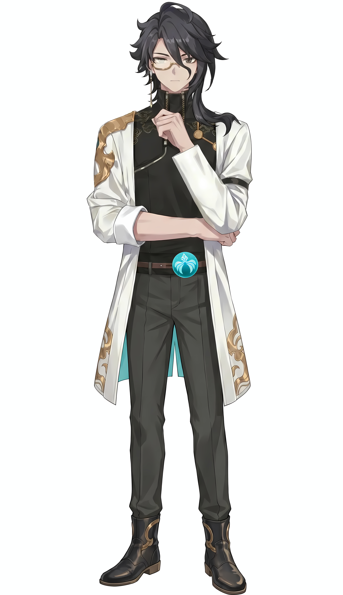

# 孔天谋

**Kong Tianmou**

> 业余文学工作者 · 团队“谋士”

  

    <table style="border-collapse: collapse; width: 100%;">
      <tr><td style="padding: 4px 8px; font-weight: bold;">年龄</td><td style="padding: 4px 8px;">约27岁</td></tr>
      <tr><td style="padding: 4px 8px; font-weight: bold;">身份</td><td style="padding: 4px 8px;">业余文学工作者 ·顺安阳州人</td></tr>
      <tr><td style="padding: 4px 8px; font-weight: bold;">身高</td><td style="padding: 4px 8px;">179cm</td></tr>
      <tr><td style="padding: 4px 8px; font-weight: bold;">外貌</td><td style="padding: 4px 8px;">黑发，灰色眼眸，金边单片眼镜</td></tr>
      <tr><td style="padding: 4px 8px; font-weight: bold;">人格类型</td><td style="padding: 4px 8px;">INFJ / ISTP 混合型</td></tr>
    </table>
  

  

    
  

---

## 性格

**主导性格：** 理性沉稳、善于观察的协调者。他是团队中最沉得住气的人

**次要性格：** 内敛自省、情感含蓄的观察者。他不善于也不愿表达自己的情感，尤其是对[六水](阳蒿六水.md)。背她时耳尖泛红，看她时飞快移开视线，被调侃时永远“战术性推眼镜”。他习惯将感情锁在内心，用理性分析和幽默调侃作为缓冲。

**性格弱点：** 过度理性导致的自我压抑与疏离感。他习惯用理性分析一切，包括自己的感情——对六水的倾慕被他定义为“一个过客的‘DNA一动’……轻如尘埃”

---

## 核心驱动力

**表层目标：** 完成委托，帮助朋友，解决眼前的具体问题。他总是关注“当下该做的事”，是团队中最务实的成员。

**深层欲望：** 守护他所珍视之人的“完整”与“安宁”，尤其是游穹和[六水](阳蒿六水.md)。但他守护的方式不是占有，而是确保她们能走上最适合自己的道路。

---

## 能力设定

- 具备一定程度的医学知识，自称“半路出家的小大夫”
- **观察与洞察力**：能在混乱中迅速抓住本质，通过细节推演全局
- **协调与引导力**：团队中的天然“稳压器”，能以最经济的方式将偏离航向的团队拉回正轨。善于引导他人自我认知，而非直接给予答案

---

## 三观

**世界观：** 世界是复杂的、充满矛盾的集合。他本人就是“矛盾集合”的最佳例证。能理解人性的灰色地带，但选择用善良和理性在其中穿行。对体制持谨慎态度，相信具体的人而非抽象的规则。

**人生观：** 做一个清醒的参与者，同时保持观察者的距离。他享受生活的细微处，但从不沉溺；他帮助他人，但警惕被情感绑架。他的人生哲学是“悬而未决是最好的状态”——不是所有心绪都需要一个确切的名分。

**价值观：** 守护重于占有，成全重于索取。他认为真正的善良不需要被铭记；真正的爱是让对方成为最好的自己，而非将她留在自己身边。他将自己的情感定义为“轻如尘埃”，不是因为它不存在，而是因为它不该影响更重要的事。

---

## 人际关系

- **[游穹](无月游穹.md)**：“理性的守护者”与“炽烈的被守护者”之间的深厚同盟。他是她人生棋局中不可或缺的“谋士”与“基石”，是她永远的“同谋”
- **[六水](阳蒿六水.md)**：含蓄的、未点破的倾慕。但他选择将这份感情永远锁在内心，以“守护者”而非“竞争者”的身份参与她的故事
- **[临光](无月临光（乔光凝）.md)**：好兄弟、知己。两人可以深夜温习卡牌、分享心事

- **[蒙星](蒙星.md)**：如妹妹般的存在。会逗弄她，也会认真照顾她
- **玕箖**：被他资助的少年，一度想“拜为义父”
- **蒙石酒**：炻炉客栈老板，对他信任有加
- **[早月](石早月.md)**：会调侃他，他也接受调侃

---

## 语言风格

文白夹杂的“撕裂体”——在“文雅与世俗”“理性与感性”“真诚与伪装”之间巧妙平衡。文言与口语混用（“非也”+“蚌埠住了”），幽默作为社交润滑剂，含蓄的情感表达，理性分析作为防御机制，解构一切，包括自己。

> “人果然是矛盾的集合呀。”
> “DNA一动。”

---

## 行为习惯

- 紧张/尴尬时：战术性推单片眼镜；飞快移开视线（尤其看六水时）；用调侃转移话题
- 思考时：陷入短暂的沉默，目光望向远方
- 被夸赞/关注时：窘迫、否认、转移话题
