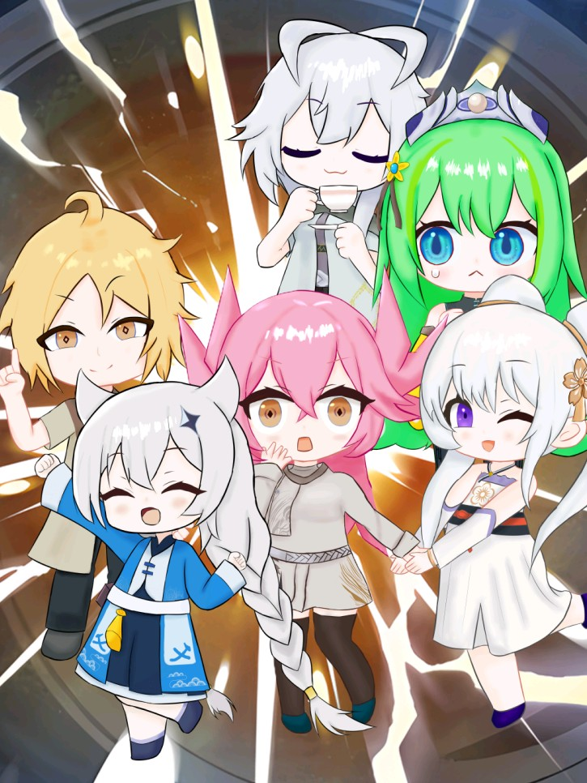

# 超融合——我的电子墓碑

## 🌟 欢迎访问设定站

这里是《超融合！》三部曲的设定站，包含完整的角色介绍、世界观设定和故事背景。

---

## 📖 三部曲概览

### 第一部：《星海余晖》

我叫零亚娜，一名普通的艾俄斯机甲驾驶员。如果非要说不普通，那就是我的同事们个个身怀绝技——且都是美少女……不对！忌克斯和凯文那两个家伙除外！

我们组成的「闪刀姬」小队，是文明对抗外星灾害的最后王牌。

敌人很可怕，叫「湮灭」，擅长把一切变成怪物和疯子。

但没关系，我们加急搞出来了闪术兵器，有黑科技神之键，有温柔的后勤姐姐，还有永不放弃的心！

……应该会赢的吧？

<b>👥 点击查看角色列表</b>

- [零亚娜](01-星海余晖/角色/零亚娜.md) — 天才驾驶员，十三英杰
- [露世芽樱](01-星海余晖/角色/露世芽樱.md) — 十三英杰，最冷静的战士
- [昔雅](01-星海余晖/角色/昔雅.md) — 生态学家，最终的十三英杰
- [七劫千秋](01-星海余晖/角色/七劫千秋.md) — 十三英杰，最火爆的战士
- [维尔妮娅](01-星海余晖/角色/维尔妮娅.md) — 十三英杰，闪术兵器系统的开发者
- [阿希亚](01-星海余晖/角色/阿希亚.md) — 十三英杰，理论物理和计算机学家，神之键计划奠基人
- [娑](01-星海余晖/角色/娑.md) — 十三英杰，心理与神经学家
- [梅比兰德](01-星海余晖/角色/梅比兰德.md) — 十三英杰，生物学家
- [凯文](01-星海余晖/角色/凯文.md) — 十三英杰，AI
- [符仪华](01-星海余晖/角色/符仪华.md) — 十三英杰，洒脱的教官
- [忌克斯](01-星海余晖/角色/忌克斯.md) — 十三英杰，沉默的教官
- [格蕾薇娅](01-星海余晖/角色/格蕾薇娅.md) — 十三英杰，能看见情绪的战士
- [伊琳娜](01-星海余晖/角色/伊琳娜.md) — 十三英杰，最负盛名的歌手
- [帕绮娜](01-星海余晖/角色/帕绮娜.md) — 昔雅的好友

---

### 第二部：《过往未来》

我是戴尔·蓉莉·李……

你不是叫 Zone 么？

呵呵，我还没提你抢我毕业设计的旧账呢？

你的学生多少也有我的扶持呢。

唉，明明我们挺像的：小时候家里都有变故，学习也一样用心……结果话说不到一块去？

可别乱说，至少刚认识你时，我很高兴有你这样的人。

但现在，你觉得我是个不切实际的理想主义者？魂炉可不是什么好东西。

时间紧迫，不管黑猫白猫，抓到老鼠，就是好猫。

所以，你铁了心要单干？

没错……因为，你也想单干。

<b>👥 点击查看角色列表</b>

- [乔伊·弗罗斯特](02-过往未来/角色/乔伊·弗罗斯特.md) — 月光会教主，天命公司温迪戈实验室主任，普罗米修斯计划主导者
- [戴尔·蓉莉·李 (Zone)](02-过往未来/角色/戴尔·蓉莉·李(Zone).md) — 未来组领袖，回溯之键修复者
- [森口智子](02-过往未来/角色/森口智子.md) — 因为父母变故而极端激进的人，被乔伊拯救，成为月光会执事
- [钟悚灵](02-过往未来/角色/钟悚灵.md) — Zone 的学生，未来组成员
- [阳蒿六水](03-异次元之融合/角色/阳蒿六水.md) — Zone 的学生，未来组成员
- [温劫](02-过往未来/角色/温劫.md) — Zone 的学生，未来组成员

---

### 第三部：《异次元之融合》

准大学生无月游穹只是被好兄弟乔光凝安利了一款"放开世界游戏"，就被打断……额，是穿越到了一个天↑才↓云↑集↑的地↓方↑~

这个"平行却居然相交"的泰伦世界虽然比地球落后二十几年，但有古灵精怪的天↗才↘小孩，喜欢吃瓜的"神奇"医生，"改名换姓"的幽默兄弟（乔光凝本凝），元气满满的"社死活动"组织大师，温婉体贴的怂包姐姐，变成顶着逆天粉毛造型的二次元美少女的自己和……

高冷神金的偷心怪盗团团长骚扰大家！

本来人齐了，凑个"万事屋"阵容，打打小牌、接接小单，这小日子也不是不能过，还挺滋润……

结果喵了个咪的，闪现过来个胖子说："游穹小姐，你穿越可不是来过家家的，得拯救世界哩。"

这下只能"阐述你的梦"了～

<b>👥 点击查看角色列表</b>

- [无月游穹](03-异次元之融合/角色/无月游穹.md) — 从地球高中生变为粉发少女的穿越者
- [无月临光 (乔光凝)](03-异次元之融合/角色/无月临光（乔光凝）.md) — 游穹的地球好友，体内有第二人格"暗魇"
- [蒙星](03-异次元之融合/角色/蒙星.md) — 炻炉客栈的灰发女孩
- [天谋](03-异次元之融合/角色/天谋.md) — 毒舌拽文的决斗者
- [石早月](03-异次元之融合/角色/石早月.md) — 活泼开朗的决斗者
- [阳蒿六水](03-异次元之融合/角色/阳蒿六水.md) — 元气满满的"社死活动"组织大师
- [乔伊·弗罗斯特 (婉冬)](03-异次元之融合/角色/乔伊·弗罗斯特2.md) — 月光会教主，天命公司温迪戈实验室主任，普罗米修斯计划主导者，性格比旧世界温和了一些？
- [XCIX](03-异次元之融合/角色/XCIX.md)

---

## 🌌 世界观设定

- [超格式塔](设定集/超格式塔.md) — 贯穿三部曲的宇宙观
